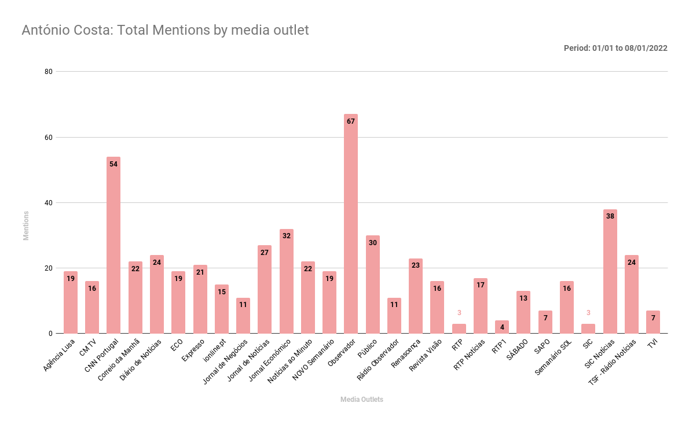
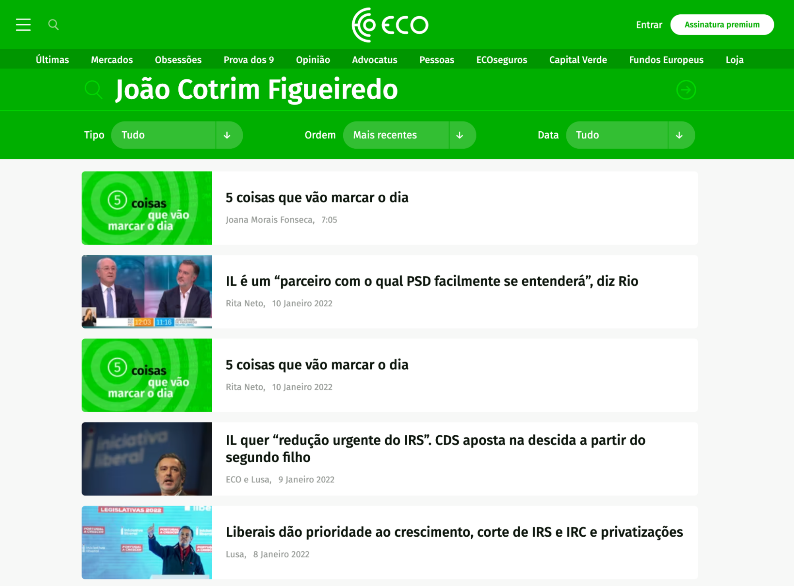

# Legislativas2022 - Media Analysis

How do media outlets' Facebook pages,  cover the main candidates to the Portuguese 2022 legislative elections

# KEY POINTS

*   António Costa leads on all quantitative analysis
*   There is a visible trend that shows that the least seats you have in parliament, the less media exposure you have
*   There are two outliers to this trend: André Ventura and Rui Tavares

*   André Ventura due to his political views and the fact the media seem to believe that covering the candidate brings more clicks, that generate more ad revenue
*   Rui Tavares exposure probably has to do with the novelty factor and what is considered a good performance during the televised debates

*   When comparing extreme reactions (“Love” and “Angry”) Francisco Rodrigues dos Santos is the surprise, being the candidate that gets more “Love Reactions”
*   António Costa comes second, only followed by Inês de Sousa Real, in the list of candidates that get more “Angry” reactions
*   André Ventura has a balanced proportion of “Love” and “Angry” reactions which comes as a surprise
*   The limitation of the keyword dataset to the candidates’ name, and its variations, are an obstacle to this study.

# INTRODUCTION

This document is the result of a more structured approach to an initial analysis done with data from CrowdTangle and that was posted on twitter as a food for thought content.

From that first analysis two charts were created.

With the provocative title “Who is more mentioned by the media?”, the first chart summed the references to each candidate name, in a period of 7 days, on Facebook posts in 24 Portuguese media outlets

The second chart aggregated mentions by media outlets, resulting in very interesting results, with the National News Agency taking the spotlight due to its non-diversity. 

The feedback that the original tweet got[[1]](#ftnt1), including some ideas, confirmed how important this theme is, in a time of general elections, and a decision was made to make a more in depth analysis of the data, by generating new datasets.

The colors used for each candidate, on the original graphics above, is the official color for each party, except for “António Costa”, where the color used was the old pink color used on the “Partido Socialista” logo. However, and based on the feedback received, the colors used for “Francisco Rodrigues dos Santos” and “Jerónimo de Sousa” are too similar and therefore the color for “Jerónimo dos Santos” will be changed to a different color.

# OBJECTIVE

Monitor, quantitatively, how many times media outlets in Portugal mention each candidate, in their titles posted to social media,  during the pre-electoral and electoral campaign for the 2022 elections.

The definition of  “Candidate” is the party leader of each party that is running for legislative elections,and whose party got to elect any candidates in the last elections, mirroring the law that states that these parties should be included in televised debates.

# MEDIA OUTLETS

To the original list of 24 media outlets 4 more were added, for a total of 28 media outlets being analysed. Media outlets in bold are those that were added after the first preliminary analysis

<table class="c25">

<tbody>

<tr class="c31">

<td class="c45" colspan="1" rowspan="1">

Agência Lusa

</td>

<td class="c42" colspan="1" rowspan="1">

CMTV

</td>

<td class="c15" colspan="1" rowspan="1">

CNN Portugal

</td>

<td class="c15" colspan="1" rowspan="1">

Correio da Manhã

</td>

</tr>

<tr class="c31">

<td class="c45" colspan="1" rowspan="1">

Diário de Notícias

</td>

<td class="c42" colspan="1" rowspan="1">

ECO

</td>

<td class="c15" colspan="1" rowspan="1">

EXPRESSO

</td>

<td class="c15" colspan="1" rowspan="1">

ionline

</td>

</tr>

<tr class="c31">

<td class="c45" colspan="1" rowspan="1">

Jornal de Negócios

</td>

<td class="c42" colspan="1" rowspan="1">

Jornal de Notícias

</td>

<td class="c15" colspan="1" rowspan="1">

Jornal Económico

</td>

<td class="c15" colspan="1" rowspan="1">

Notícias ao Minuto

</td>

</tr>

<tr class="c31">

<td class="c45" colspan="1" rowspan="1">

NOVO Semanário

</td>

<td class="c42" colspan="1" rowspan="1">

Observador

</td>

<td class="c15" colspan="1" rowspan="1">

Público

</td>

<td class="c15" colspan="1" rowspan="1">

Rádio Observador

</td>

</tr>

<tr class="c31">

<td class="c45" colspan="1" rowspan="1">

Revista Visão

</td>

<td class="c42" colspan="1" rowspan="1">

RTP

</td>

<td class="c15" colspan="1" rowspan="1">

RTP Notícias

</td>

<td class="c15" colspan="1" rowspan="1">

RTP1

</td>

</tr>

<tr class="c31">

<td class="c45" colspan="1" rowspan="1">

SÁBADO

</td>

<td class="c42" colspan="1" rowspan="1">

SAPO

</td>

<td class="c15" colspan="1" rowspan="1">

SIC[[2]](#ftnt2)

</td>

<td class="c15" colspan="1" rowspan="1">

SIC Notícias[[3]](#ftnt3)

</td>

</tr>

<tr class="c31">

<td class="c45" colspan="1" rowspan="1">

TSF - Rádio Notícias

</td>

<td class="c42" colspan="1" rowspan="1">

TVI

</td>

<td class="c15" colspan="1" rowspan="1">

</td>

<td class="c15" colspan="1" rowspan="1">

</td>

</tr>

</tbody>

</table>

At the date of the data extraction, this was the follower count for each media outlet’s page on Facebook

“Jornal de Notícias” and “TVI” are the only media outlets with more than 2M followers on Facebook. In the case of “Jornal de Notícias” this contrasts with the fact that the newspaper doesn’t even make it to the TOP 10 of paid newspapers in Portugal[[4]](#ftnt4)

Also of note is the fact that the national news agency “Agência Lusa” and the national TV stations ( RTP, RTP1 and RTP Notícias) do not have many followers on Facebook.

# SETTINGS & KEYWORDS

The keywords used in this study refer only to the candidate, and exclude the party name.

In order to trim down the dataset to be extracted the search refers only to Pages, with relevance in Portugal, and with the primary admin from Portugal. 

António Costa

"António Costa", "Costa", "Líder do PS", "Líder Socialista"

Rui Rio

"Rui Rio", "Rio", "Líder do PSD", "Líder do PPD/PSD", "Líder da oposição"

Catarina Martins

“Catarina Martins”, “Catarina”, “Líder do Bloco”

Jerónimo de Sousa

“Jerónimo de Sousa”, “Jerónimo”,”Líder Comunista”

Francisco Rodrigues dos Santos

"Francisco Rodrigues dos Santos","Líder do CDS" NOT "José Rodrigues dos Santos[[5]](#ftnt5)"

Inês de Sousa Real

"Inês Sousa Real", "Inês de Sousa Real", "Líder do PAN", "Líder do Partido PAN", “Sousa Real”, “Inês Sousa-Real”

André Ventura

"André Ventura", "Ventura", "Líder do CHEGA"

João Cotrim Figueiredo

“João Cotrim Figueiredo”, “João Cotrim”, “Cotrim Figueiredo”,“Líder da IL”, “Líder da Iniciativa Liberal”

# 

Rui Tavares

“Rui Tavares”, “Líder do LIVRE”, “Líder do Partido Livre”

# METHODOLOGY

1.  Search Crowdtangle for every candidate’s respective keywords
2.  Export to .csv
3.  Import each individual .csv to separate sheets on Google Sheets and rename the sheets with the candidate’s initials
4.  On a sheet name “counters”apply the following formula for each candidate =COUNTIF(candidate_initials!$A$2:$A$9000,media_outlet_name)
5.  Sum the values on each column
6.  Generate graphics

The “counters” spreadsheet looks like this

The resulting numbers are from datasets used in the preliminary analysis, and are for reference only.

# OBSTACLES

The initial idea was to include in the search the name of the parties. However this idea was dropped given the need for a data treatment and validation process that would rule impossible to make this analysis in a timely manner. Therefore it was assumed that only the name of the candidates, and consequently the most common variations of the name, was to be used.

# 

# DATASETS

## General

The raw dataset exported by CrowdTangle includes the following columns

<table class="c25">

<tbody>

<tr class="c31">

<td class="c0" colspan="1" rowspan="1">

User Name

</td>

<td class="c0" colspan="1" rowspan="1">

Facebook ID

</td>

<td class="c0" colspan="1" rowspan="1">

Page Category

</td>

<td class="c0" colspan="1" rowspan="1">

Page Admin Top Country

</td>

</tr>

<tr class="c31">

<td class="c0" colspan="1" rowspan="1">

Page Description

</td>

<td class="c0" colspan="1" rowspan="1">

Page Created

</td>

<td class="c0" colspan="1" rowspan="1">

Likes at Posting

</td>

<td class="c0" colspan="1" rowspan="1">

Followers at Posting

</td>

</tr>

<tr class="c31">

<td class="c0" colspan="1" rowspan="1">

Post Created

</td>

<td class="c0" colspan="1" rowspan="1">

Post Created Date

</td>

<td class="c0" colspan="1" rowspan="1">

Post Created Time

</td>

<td class="c0" colspan="1" rowspan="1">

Type

</td>

</tr>

<tr class="c31">

<td class="c0" colspan="1" rowspan="1">

Total Interactions

</td>

<td class="c0" colspan="1" rowspan="1">

Likes

</td>

<td class="c0" colspan="1" rowspan="1">

Comments

</td>

<td class="c0" colspan="1" rowspan="1">

Shares

</td>

</tr>

<tr class="c31">

<td class="c0" colspan="1" rowspan="1">

Love

</td>

<td class="c0" colspan="1" rowspan="1">

Wow

</td>

<td class="c0" colspan="1" rowspan="1">

Haha

</td>

<td class="c0" colspan="1" rowspan="1">

Sad

</td>

</tr>

<tr class="c31">

<td class="c0" colspan="1" rowspan="1">

Angry

</td>

<td class="c0" colspan="1" rowspan="1">

Care

</td>

<td class="c0" colspan="1" rowspan="1">

Video Share Status

</td>

<td class="c0" colspan="1" rowspan="1">

Is Video Owner?

</td>

</tr>

<tr class="c31">

<td class="c0" colspan="1" rowspan="1">

Post Views

</td>

<td class="c0" colspan="1" rowspan="1">

Total Views

</td>

<td class="c0" colspan="1" rowspan="1">

Total Views at all Crossposts

</td>

<td class="c0" colspan="1" rowspan="1">

Video Length

</td>

</tr>

<tr class="c31">

<td class="c0" colspan="1" rowspan="1">

URL

</td>

<td class="c0" colspan="1" rowspan="1">

Message

</td>

<td class="c0" colspan="1" rowspan="1">

Link

</td>

<td class="c0" colspan="1" rowspan="1">

Final Link

</td>

</tr>

<tr class="c31">

<td class="c0" colspan="1" rowspan="1">

Image Text

</td>

<td class="c0" colspan="1" rowspan="1">

Link Text

</td>

<td class="c0" colspan="1" rowspan="1">

Description

</td>

<td class="c0" colspan="1" rowspan="1">

Sponsor ID

</td>

</tr>

<tr class="c31">

<td class="c0" colspan="1" rowspan="1">

Sponsor Name

</td>

<td class="c0" colspan="1" rowspan="1">

Sponsor Category

</td>

<td class="c0" colspan="1" rowspan="1">

Total Interactions[[6]](#ftnt6)

</td>

<td class="c0" colspan="1" rowspan="1">

Overperforming Score

</td>

</tr>

</tbody>

</table>

With the amount of information given it is possible to perform several analyses, but we always have to keep in mind that “Posts with the most interactions do not equal posts with the most content views or reach” as per Crowdtangle’s advisory.

# 

## António Costa

Dataset extracted resulted in a .csv file with 2.7MB and 2416 rows.

After filtering the dataset by media outlets, the total references amount to 580, which is a 62.5%increase from the preliminary analysis, meaning that the insertion of new keywords and media outlets give us a more precise idea of the amount of coverage this candidate got.

# 

## Rui Rio

Dataset extracted resulted in a .csv file with 1.3MB and 1143 rows.

After filtering the dataset by media outlets, the total references amount to 341, which is a 53.4% increase from the preliminary analysis.

## Rui Rio

Being Rui Rio the leader of the biggest opposition party, in the last legislature, a direct comparison with the current prime minister shows us that, in all media outlets, there are more references to “António Costa” than to “Rui Rio”, even if we are in a pre-campaign period with both party leaders appearing on TV debates almost daily.

## Catarina Martins

Dataset extracted resulted in a .csv file with 1MB and 946 rows.

After filtering the dataset by media outlets, the total references amount to 213, which is a 40.8% increase from the preliminary analysis.

This dataset, that focus on the leader of the third major political force in Portugal, shows the first 0 results with some media outlets not mentioning “Catarina Martins”[[7]](#ftnt7) at all during the period in analysis, despite the on-going pre-electoral debates.

## Jerónimo de Sousa[[8]](#ftnt8)

Dataset extracted resulted in a .csv file with 313kb and 254 rows.

After filtering the dataset by media outlets, the total references amount to 90, which is a 47.8% increase from the preliminary analysis.

Jerónimo de Sousa is the leader of the 4th biggest party in parliament, during the previous legislature but the data shows that he wasn’t mentioned by 5 of the 28 media outlets (17%) that are under analysis.

## Francisco Rodrigues dos Santos

Dataset extracted resulted in a .csv file with 118kb and 120 rows.

After filtering the dataset by media outlets, the total references amount to 87, which is a 77.0% increase from the preliminary analysis. This increase is directly linked to the keywords used for this search. Also noteworthy is the weight of “Observador” in these results, which contributes with more than a quarter of the mentions (27.0%).

## Inês de Sousa Real

Dataset extracted resulted in a .csv file with 110kb and 85 rows.

After filtering the dataset by media outlets, the total references amount to 35, which is a 2.07% decrease from the preliminary analysis, or one mention. This is due to using a  more tight set of keywords for this query.

The lack of representation of PAN’s (Pessoas Animais Natureza) leader in the media outlets is visible, with only 12 media outlets out of 28 (42.9%) mentioning her name, even with the pre-electoral campaign televised debates happening.

## André Ventura

Dataset extracted resulted in a .csv file with 908kb and 813 rows.

After filtering the dataset by media outlets, the total references amount to 283, which is a 50.2% increase from the preliminary analysis.

However this dataset deserves more attention because the trend, up to now, was the less seats you have in parliament the less mentions you have in the media.

André Ventura (the leader of an extreme-right party) breaks this trend and has more mentions than Catarina Martins, the third biggest political party, in the previous legislature, in Portugal. André Ventura was only able to elect one person, himself, in the last general elections.

## André Ventura

Repeating the exercise we did before between António Costa and Rui Rio, it’s clear that Ventura has an unproportional media exposure when compared with parties that have much more representation in the parliament.

## João Cotrim Figueiredo

Dataset extracted resulted in a .csv file with 127kb and 103 rows.

After filtering the dataset by media outlets, the total references amount to 48, which is a 29.2% increase from the preliminary analysis.

When the first analysis was published on Twitter, some readers made reference to the fact that it was impossible for “ECO” to not mention “João Cotrim Figueiredo”. After all, the candidate is a columnist in that media outlet and the “ECO” is seen as a supporter of the ideas forwarded by “Iniciativa Liberal”[[9]](#ftnt9).

## João Cotrim Figueiredo

However a quick search on ECO’s website shows us the reason why this happens

The title references are never done using the candidate’s name, but the party name or “Liberais” (meaning those that belong to the party “Iniciativa Liberal”)

This is an important insight that can lead to changes in the way candidates are referred to in the titles that are shared on Facebook / Social Media channels.

## Rui Tavares

Dataset extracted resulted in a .csv file with 263kb and 226 rows.

After filtering the dataset by media outlets, the total references amount to 96, which is a 30.2% increase from the preliminary analysis.

The effect of the televised debates, and pre-electoral campaign, can be clearly observed here. Rui Tavares’s party, “Livre” did elect one candidate in the previous electoral elections, but that candidate cut its ties to the party[[10]](#ftnt10).

# ANALYSIS

We will start by plotting the same two original graphs, based on the values retrieved from the new datasets.

The observed trend on the preliminary analysis doesn’t change: Mentions by number of seats in Parliament decrease in line with what is expected, and “André Ventura” is the exceptio along with  “Rui Tavares” that also has a number of mentions that doesn’t reflect the party’s representation in parliament, probably due to the participation in televised debates,a good performance at those, and for  being the novelty candidate.

Performing a standardization of the data, this is the overall picture of the combined datasets.

# FURTHER ANALYSIS

However it is important to dig further into the data available and understand how these mentions correlate with some of the metrics present in the dataset, particularly “Shares”, “Likes”, “Love” and “Angry” in an attempt to have a very basic, but yet important, sentiment analysis of the content.

Why are “Love” and “Angry” reactions important?

“Five years ago, Facebook gave its users five new ways to react to a post in their news feed beyond the iconic “like” thumbs-up: “love,” “haha,” “wow,” “sad” and “angry.”

Behind the scenes, Facebook programmed the algorithm that decides what people see in their news feeds to use the reaction emoji as signals to push more emotional and provocative content — including content likely to make them angry. Starting in 2017, Facebook’s ranking algorithm treated emoji reactions as five times more valuable than “likes,” internal documents reveal. The theory was simple: Posts that prompted lots of reaction emoji tended to keep users more engaged, and keeping users engaged was the key to Facebook’s business.”[[11]](#ftnt11)

In the next pages that analysis will be done, using the data provided by CrowdTangle.

## Shares

“Shares”, per candidate, were calculated based on the datasets. “Catarina Martins”, with less mentions, amasses more shares, on Facebook, than Rui Rio. However both combined don’t surpass “André Ventura” in the number of shares.

## Shares

When analyzing the shares by media outlets, it’s clear the prevalence of “António Costa” in all media outlets, except on “Rádio Observador”. However we are talking about 65 mentions, with no other candidate mention being shared by those that follow “Rádio Observador”. Also keep in mind that this page only has 1708 followers[[12]](#ftnt12).

## Likes

As with “Shares” the total of likes, per candidate, were calculated based on the datasets. “Catarina Martins”, with less mentions, amasses more likes, marginally, on Facebook than Rui Rio. However both combined don’t surpass “André Ventura” in the number of likes. This is consistent with the trend observed with shares[[a]](#cmnt1).

When exploring the amount of likes, per media outlet, that each candidate’s mention gets, it’s important to note the performance of “António Costa” that even in media outlets where he gets less mentions, gets a majority of likes, as observed in “SIC” where with only 30% of mentions gets 89.7% of likes.

## LOVE vs ANGRY

Facebook provides users with a set of reactions. “Love” and “Angry” are the extremes and can be used to extract a basic sentiment analysis of the content. These reactions, as explained before, have more weight than the regular “Likes”

When comparing the amount of “Love” and “Angry” reactions that each candidate got, during the period in analysis, the results go against common sense.

“António Costa” (68.2%) is only second in “Angry” reactions to “Inês Sousa Real”(76.9%), and “Francisco Rodrigues dos Santos” is the mention that gets more “Love” (61.3%)

Also of note is “André Ventura” (45.7%) that attracts a balanced mix of “Angry” and “Love” reactions when he is mentioned by media outlets on Facebook.

This results can be indicative of user sentiment, but a much more complex analysis would have to be done in order to determine it properly.

# CONCLUSIONS AND NEXT STEPS

## CONCLUSIONS

Based on the extracted dataset the media mentions of the several candidates is unbalanced. Some candidates get less mentions than others, even if we are in a period of pre-electoral campaign, with all the candidates participating in televised debates.

The data gathered raises questions of how organic/natural the behaviour for “André Ventura” is but, nevertheless, it is clear that media outlets mention the candidate in a disproportionate way, when compared with the leader and candidate of the third major party in the parliament , “Catarina Martins”, and with candidates that have the same representation in the parliament that ceases functions now.

## NEXT STEPS

The search queries will be run again on January 29th with the results posted on twitter on the same day.

The period in analysis will be January 01st to January 28th

A report will be written afterwards, already taking into account the election’s results.

## ACKNOWLEDGEMENTS

James Morgan, META

João Pires Ribeiro, IST

João Oliveira, Independent Communications Consultant

Miguel Paisana, Obercom

Inês Narciso, ISCTE

Isabel Silva, everything

## ABOUT CROWDTANGLE

All data in this report comes from CrowdTangle, a Facebook-owned tool that tracks interactions on public content from Facebook pages and groups, verified profiles, Instagram accounts, and subreddits. It does not include paid ads unless those ads began as organic, non-paid posts that were subsequently “boosted” using Facebook’s advertising tools. It also does not include activity on private accounts, or posts made visible only to specific groups of followers.

CrowdTangle is a public insights tool from Facebook that makes it easy to follow, analyze, and report on what’s happening across social media. Facebook acquired CrowdTangle in November, 2016, made the tool free, and expanded access from 300 media partners to more than 10,000, including global sports leagues, local newspapers, digital publishers, music labels, celebrity accounts, and more.

Starting in 2019, CrowdTangle added research, academic and fact-checking partners, and built tools to help these partners study how public content spreads across Facebook and Instagram. By building products to more easily track public content, CrowdTangle has become the best way for outside organizations to have greater transparency into what’s happening on Facebook and Instagram. The hope is that a greater shared understanding around how public content spreads will shape the broader online conversation, and help make information on social media safer, more reliable, and more accurate.

# LICENSE

Creative Commons Attribution-NonCommercial-NoDerivatives 4.0 International Public License

By exercising the Licensed Rights (defined below), You accept and agree to be bound by the terms and conditions of this Creative Commons Attribution-NonCommercial-NoDerivatives 4.0 International Public License ("Public License"). To the extent this Public License may be interpreted as a contract, You are granted the Licensed Rights in consideration of Your acceptance of these terms and conditions, and the Licensor grants You such rights in consideration of benefits the Licensor receives from making the Licensed Material available under these terms and conditions.

[]

* * *

[[1]](#ftnt_ref1)  [The tweet](https://twitter.com/JGomes_PT/status/1480208101378822144)had 43490 impressions on January 10th 2022\.

[[2]](#ftnt_ref2) The media group that owns SIC was a victim of a ransomware attack during this period.The values shown do not reflect the channel’s communication in a normal period.

[[3]](#ftnt_ref3) The media group that owns SIC Notícias was a victim of a ransomware attack during this period.The values shown do not reflect the channel’s communication in a normal period.

[[4]](#ftnt_ref4)[PT][Cision Report](https://www.cision.pt/2021/09/imprensa-circulacao-paga-cresce-face-a-2020/) 

[[5]](#ftnt_ref5) José Rodrigues dos Santos, who shares the same family names with the candidate, is a Portuguese journalist and book author. The search settings take that into account and ignore any results where “José Rodrigues dos Santos” appears.

[[6]](#ftnt_ref6)  **weighted**  —  Likes 1x Shares 1x Comments 1x Love 1x Wow 1x Haha 1x Sad 1x Angry 1x Care 1x

[[7]](#ftnt_ref7) Please refer to Settings and Keywords for all the keywords used in the search

[[8]](#ftnt_ref8) Although the official color of PCP (Portuguese Communist Party) is red, and the color of the coalition between PCP and the Portuguese Green party is blue, a decision was made to use yellow as the color for Jerónimo de Sousa, as both official colors don’t have enough contrast when joined with the other parties. The yellow chosen is the one from the [flag of the former Soviet Union](https://en.wikipedia.org/wiki/Flag_of_the_Soviet_Union)

[[9]](#ftnt_ref9)** This is an opinion **

[[10]](#ftnt_ref10) [Joacine deixa de representar Livre](https://www.publico.pt/2020/02/03/politica/noticia/joacine-deixa-representar-livre-passa-deputada-naoinscrita-partir-hoje-1902643)

[[11]](#ftnt_ref11)  [Washington Post - Five points for anger, one for a ‘like’: How Facebook’s formula fostered rage and misinformation](https://www.washingtonpost.com/technology/2021/10/26/facebook-angry-emoji-algorithm/) / **Emphasis by the author**

[[12]](#ftnt_ref12) At the time the data was extracted. Please refer to page 26 for normalized analysis

[[13]](#ftnt_ref13)[ Full terms of this License can be found here](https://creativecommons.org/licenses/by-nc-nd/4.0/legalcode)

